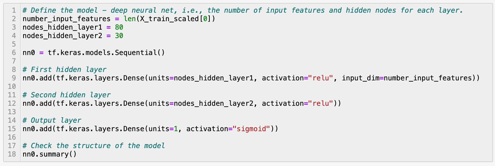
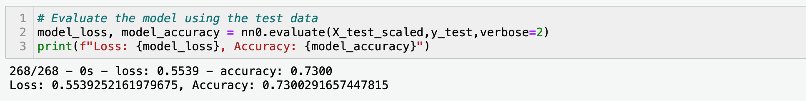
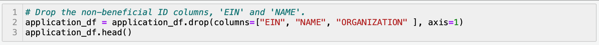
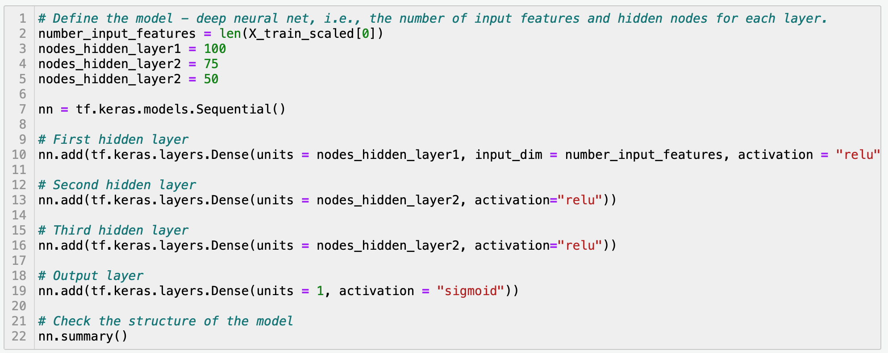
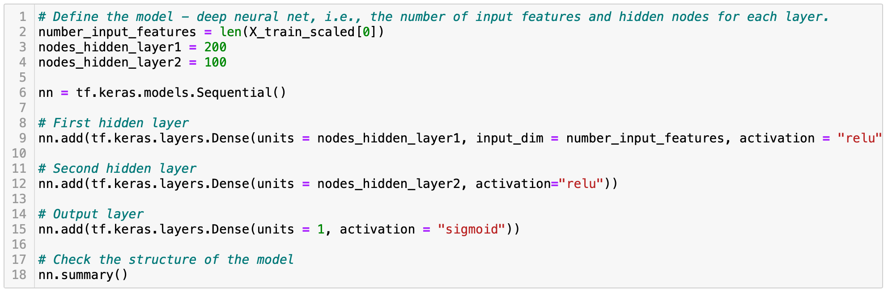
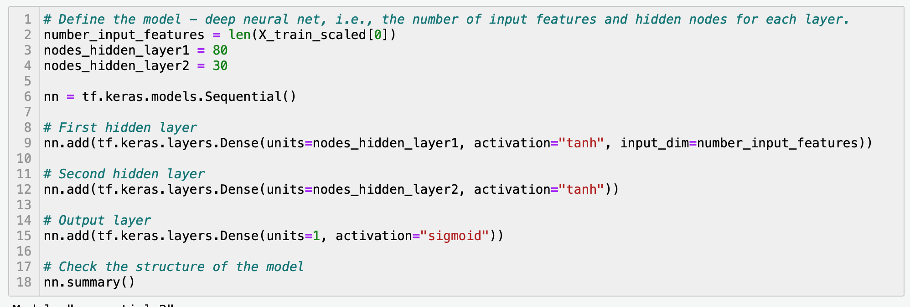

# Neural_Network_Charity_Analysis
UCB Challenge: Apply skills in machine learning and neural networks and use the features in the provided dataset to create a binary classifier that is capable of predicting whether applicants will be successful if funded by a charitable foundation.

# Analysis Overview

The purpose of this project is to use deep-learning neural networks with the TensorFlow platform to analyze and classify to predict which applicants will be successful if granted a charitable donation. To be able to do this the data was first preprocessed for the neural network model. The next step was to compile, train and evaluate the model. 

# Results

## Data Preprocessing

* The columns EIN and NAME are identification information were removed from the input data.
* The column IS_SUCCESSFUL contained binary data which referred to weither or not the charity donation was used effectively; It is then considered as the target for our deep learning neural network.
* The features for our model are: APPLICATION_TYPE, AFFILIATION, CLASSIFICATION, USE_CASE, ORGANIZATION, STATUS, INCOME_AMT, SPECIAL_CONSIDERATION and ASK_AMT, which are columns in the dataset..
* Categorical variables were encoded and split into training and testing datasets. Standardization was then applied to the features.
* The input data had 25,724 samples and 43 features.

## Compiling, Training, and Evaluating the Model

* This deep-learning neural network model is made of two hidden layers; The first layer had 80, while the second layer had 30.
* The input data had 25,724 samples and 43 features.
* The Rectified Linear Unit or ReLU activation function was used for the hidden layers. The Sigmoid is used on the output layer, because the desired output is binary classification.

* In compiling, the optimizer used is adam and the loss function is binary_crossentropy.
* The model's  accuracy is under 75% (as shown in the image below), which is not a satisfying performance to help predict the outcome of the charity donations.

## Attempts Made to Increase the Performance of the Model
Several attempts were done to increase the performance of the model. Despite the changes I made, all still yielded results that were less than 75%.

* Removed one of the features. The one I selected was ORGANIZATION

* Increased the number of hidden layers and modified the number of neurons for each layer.

* Increased the number of neurons for each layer as well as increased the epochs from 50 to 100.

* Changed the activation from ReLu to Tanh

# Summary

The deep learning neural network model did not reach the target of 75% accuracy. The loss in accuracy might be because the fact the model overfitted. To increase accuracy, more data could be added OR more features removed to further optimize the neural network. Since the desired output is binary classification, a supervised learning model like the Random Forest Classifier might be able to do the same thing and yield better accuracy results. Aside from performing faster thab neural networks, using this model instead could have avoided the data from overfitting.
